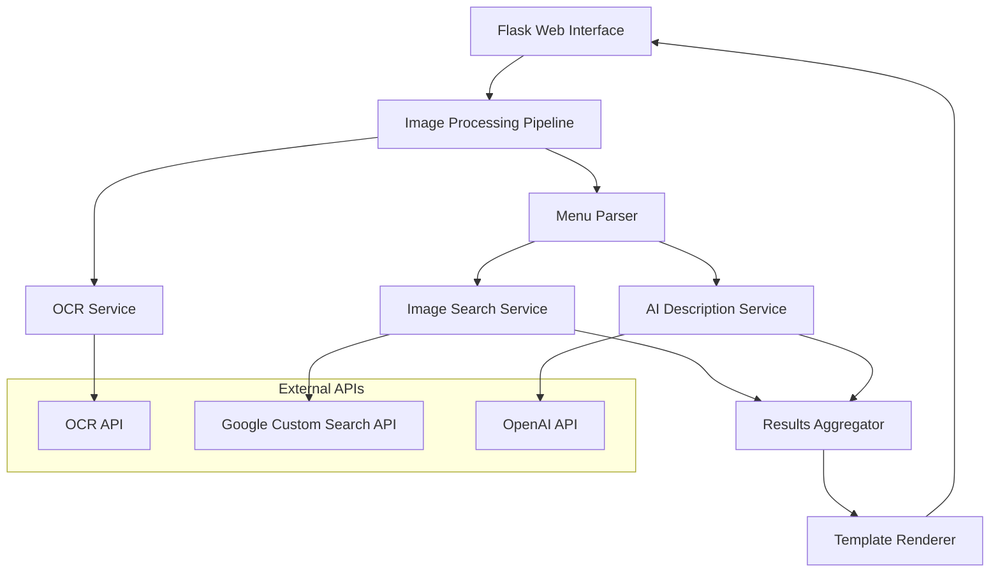

# Design Document: Menu Image Analyzer

## Overview

The Menu Image Analyzer is a Flask-based web application that transforms menu photos into rich, visual dining guides. The system addresses the common problem of restaurants not providing food images, leaving diners uncertain about their choices. By combining OCR technology, image search APIs, and AI-powered descriptions, the application creates an enhanced menu experience that helps users make informed dining decisions.

The application follows a server-side architecture using Flask with Python, integrating external APIs for core functionality. This design enables deployment on Python-compatible hosting platforms including Hugging Face Spaces, Heroku, Railway, and Render, while maintaining rich interactive capabilities through server-side processing and dynamic HTML templates or Gradio interfaces.

## Architecture

### High-Level Architecture



### Component Architecture

The application uses a modular Flask architecture with clear separation of concerns:

- **Presentation Layer**: Flask routes and Jinja2 templates for standard deployment, or Gradio interface for Hugging Face Spaces
- **Service Layer**: Python modules for OCR, image search, and AI description generation
- **Data Layer**: In-memory processing with structured data models using Pydantic
- **Integration Layer**: HTTP clients with error handling and rate limiting
- **Deployment Layer**: Multiple deployment configurations (standard Flask for Heroku/Railway/Render, Hugging Face Spaces with Gradio)

## Components and Interfaces

### Core Components

#### 1. Image Upload Route
**Responsibility**: Handle image upload via Flask route
**Interface**:
```python
@app.route('/upload', methods=['POST'])
def upload_image():
    # Handle file upload and validation
    pass

class ImageUploadForm:
    def validate_file(self, file) -> bool:
        # Validate image format and size
        pass
```

#### 2. Menu Processing Pipeline
**Responsibility**: Orchestrate the complete menu analysis workflow
**Interface**:
```python
class MenuProcessor:
    def process_menu(self, image_file: bytes) -> MenuAnalysisResult:
        # Process uploaded image through pipeline
        pass

@dataclass
class MenuAnalysisResult:
    dishes: List[DishInfo]
    processing_time: float
    errors: List[ProcessingError]
```

#### 3. OCR Service
**Responsibility**: Extract text from menu images using external OCR API
**Interface**:
```python
class OCRService:
    def extract_text(self, image_file: bytes) -> OCRResult:
        # Call external OCR API
        pass

@dataclass
class OCRResult:
    text: str
    confidence: float
    language: str
    bounding_boxes: List[TextRegion]
```

#### 4. Menu Parser
**Responsibility**: Parse extracted text to identify dishes and prices
**Interface**:
```python
class MenuParser:
    def parse_dishes(self, ocr_text: str) -> List[ParsedDish]:
        # Parse text to extract dishes and prices
        pass

@dataclass
class ParsedDish:
    name: str
    price: str
    description: Optional[str]
    confidence: float
```

#### 5. Image Search Service
**Responsibility**: Retrieve food images using Google Custom Search API
**Interface**:
```python
class ImageSearchService:
    def search_food_images(self, dish_name: str) -> List[FoodImage]:
        # Search for food images
        pass

@dataclass
class FoodImage:
    url: str
    thumbnail_url: str
    title: str
    source: str
    width: int
    height: int
```

#### 6. AI Description Service
**Responsibility**: Generate informative dish descriptions using OpenAI API
**Interface**:
```python
class DescriptionService:
    def generate_description(self, dish_name: str) -> DishDescription:
        # Generate AI description
        pass

@dataclass
class DishDescription:
    text: str
    ingredients: List[str]
    dietary_info: List[str]
    cultural_context: Optional[str]
```

#### 7. Results Template
**Responsibility**: Present analyzed menu data using Jinja2 templates
**Interface**:
```python
@app.route('/results/<session_id>')
def show_results(session_id: str):
    # Render results template with enriched dishes
    pass

# Template context
class ResultsContext:
    dishes: List[EnrichedDish]
    processing_status: ProcessingStatus
    error_messages: List[str]
```

## Data Models

### Core Data Structures

```python
from dataclasses import dataclass
from typing import List, Optional, Dict, Any
from enum import Enum

# Main dish data model
@dataclass
class Dish:
    id: str
    name: str
    original_name: str  # Preserve original text from menu
    price: str
    confidence: float  # OCR confidence score
    position: Dict[str, int]  # Location in original image

# Enhanced dish with all enrichment data
@dataclass
class EnrichedDish:
    dish: Dish
    images: Dict[str, Any]  # primary, secondary, placeholder
    description: DishDescription
    processing_status: ProcessingStatus

# Image metadata
@dataclass
class FoodImage:
    url: str
    thumbnail_url: str
    title: str
    source: str
    width: int
    height: int
    load_status: str  # 'loading' | 'loaded' | 'error'

# AI-generated content
@dataclass
class DishDescription:
    text: str
    ingredients: List[str]
    dietary_restrictions: List[str]
    cuisine_type: Optional[str]
    spice_level: Optional[str]  # 'mild' | 'medium' | 'hot'
    preparation_method: Optional[str]
    confidence: float

# Processing state management
class ProcessingStep(Enum):
    UPLOAD = "upload"
    OCR = "ocr"
    PARSING = "parsing"
    ENRICHMENT = "enrichment"
    COMPLETE = "complete"

@dataclass
class ProcessingState:
    current_step: ProcessingStep
    progress: int  # 0-100
    errors: List[ProcessingError]
    start_time: str
    estimated_completion: Optional[str]

@dataclass
class ProcessingError:
    type: str  # 'ocr' | 'parsing' | 'image_search' | 'description' | 'network'
    message: str
    dish_id: Optional[str]
    recoverable: bool
    timestamp: str
```

### API Integration Models

```python
from pydantic import BaseModel
from typing import Dict, Any

# External API configurations
class APIConfig(BaseModel):
    ocr: Dict[str, Any]
    image_search: Dict[str, Any]
    ai_description: Dict[str, Any]

# Rate limiting and caching
class RequestCache:
    def __init__(self):
        self.ocr_results: Dict[str, OCRResult] = {}  # Keyed by image hash
        self.image_search_results: Dict[str, List[FoodImage]] = {}  # Keyed by dish name
        self.descriptions: Dict[str, DishDescription] = {}  # Keyed by dish name
```

## Correctness Properties

*A property is a characteristic or behavior that should hold true across all valid executions of a system—essentially, a formal statement about what the system should do. Properties serve as the bridge between human-readable specifications and machine-verifiable correctness guarantees.*

### Property Reflection

After analyzing all acceptance criteria, several properties can be consolidated to eliminate redundancy:

- Properties 1.1 and 1.5 both deal with file validation and can be combined into a comprehensive file handling property
- Properties 3.2, 3.3, and 5.2 all relate to image display and can be consolidated into display layout properties
- Properties 7.1, 7.2, and 7.5 all deal with error handling and user feedback, which can be streamlined
- Properties 4.1, 4.2, 4.3, and 4.4 all relate to description generation and can be combined

### Core Properties

**Property 1: File Format Validation**
*For any* uploaded file, the system should accept valid image formats (JPEG, PNG, WebP) and reject invalid formats with descriptive error messages
**Validates: Requirements 1.1, 1.5**

**Property 2: Camera Integration**
*For any* camera capture event, the system should properly handle the resulting image blob and process it like uploaded files
**Validates: Requirements 1.2**

**Property 3: Language-Agnostic Processing**
*For any* menu image regardless of language, the OCR processing should attempt extraction without failing due to language barriers
**Validates: Requirements 1.3, 2.3**

**Property 4: Progress Feedback**
*For any* processing operation that takes time, the system should display progress indicators and maintain them until completion
**Validates: Requirements 1.4, 7.2**

**Property 5: Dish Extraction Completeness**
*For any* successfully processed menu, all identifiable dishes should be extracted with their associated prices when available
**Validates: Requirements 2.1, 2.2**

**Property 6: Robust Extraction**
*For any* menu image with unclear or partially obscured text, the system should attempt best-effort extraction rather than failing completely
**Validates: Requirements 2.4**

**Property 7: Image Search Integration**
*For any* identified dish, the system should attempt to retrieve relevant food images and handle both success and failure cases appropriately
**Validates: Requirements 3.1, 3.4**

**Property 8: Display Layout Consistency**
*For any* processed dish, the display should show exactly one primary image prominently, with secondary images in a scrollable format when available
**Validates: Requirements 3.2, 3.3, 5.2**

**Property 9: Comprehensive Description Generation**
*For any* processed dish, the AI description should include relevant ingredients, preparation methods, cultural context, and dietary information when identifiable
**Validates: Requirements 4.1, 4.2, 4.3, 4.4**

**Property 10: Graceful Description Fallback**
*For any* dish where description generation fails, the system should display the dish name without additional text rather than showing error messages
**Validates: Requirements 4.5**

**Property 11: Complete Results Display**
*For any* completed processing operation, all successfully identified dishes should be displayed in an organized layout with preserved price formatting
**Validates: Requirements 5.1, 5.4**

**Property 12: Secondary Image Navigation**
*For any* dish with multiple images, the interface should provide horizontal scrolling functionality for secondary images
**Validates: Requirements 5.3**

**Property 13: API Security**
*For any* external API integration, sensitive credentials should not be exposed in client-side code or network requests
**Validates: Requirements 6.4**

**Property 14: Error Handling with Recovery**
*For any* network failure or external service unavailability, the system should display helpful error messages with retry options and graceful degradation
**Validates: Requirements 7.1, 7.4**

**Property 15: Partial Success Handling**
*For any* processing operation with mixed results, successful extractions should be displayed while clearly noting any failures
**Validates: Requirements 7.3**

**Property 16: Critical Error Guidance**
*For any* critical error that prevents core functionality, the system should provide clear guidance for user next steps
**Validates: Requirements 7.5**

<function_calls>
<invoke name="prework">
<parameter name="featureName">menu-image-analyzer

## Error Handling

### Error Categories and Strategies

#### 1. Input Validation Errors
**Scenarios**: Invalid file formats, corrupted images, oversized files
**Strategy**: Client-side validation with immediate feedback
**User Experience**: Clear error messages with specific guidance (e.g., "Please upload a JPEG, PNG, or WebP image under 10MB")
**Recovery**: Allow immediate retry with different file

#### 2. Network and API Errors
**Scenarios**: OCR API failures, image search timeouts, AI service unavailability
**Strategy**: Exponential backoff retry with circuit breaker pattern
**User Experience**: Progress indicators with retry options, graceful degradation messages
**Recovery**: Automatic retry for transient failures, manual retry option for persistent issues

#### 3. Processing Errors
**Scenarios**: No text detected in image, no dishes identified, parsing failures
**Strategy**: Best-effort processing with partial results
**User Experience**: Display successful extractions while noting failures, suggest image quality improvements
**Recovery**: Allow re-upload with guidance on image quality

#### 4. External Service Degradation
**Scenarios**: API rate limits, service outages, quota exhaustion
**Strategy**: Graceful degradation with core functionality preservation
**User Experience**: Inform users of limited functionality, provide alternatives
**Recovery**: Queue requests for later processing, suggest trying again later

#### 5. Security and Authentication Errors
**Scenarios**: Invalid API keys, authentication failures, CORS issues
**Strategy**: Secure credential management with fallback options
**User Experience**: Generic error messages to avoid exposing security details
**Recovery**: Administrative intervention required, user guidance for reporting issues

### Error Recovery Mechanisms

```typescript
interface ErrorRecoveryStrategy {
  canRecover: boolean;
  retryable: boolean;
  maxRetries: number;
  backoffStrategy: 'linear' | 'exponential';
  fallbackAction?: () => void;
  userGuidance: string;
}

const errorStrategies: Record<ErrorType, ErrorRecoveryStrategy> = {
  INVALID_FILE: {
    canRecover: true,
    retryable: false,
    maxRetries: 0,
    backoffStrategy: 'linear',
    userGuidance: 'Please select a valid image file (JPEG, PNG, or WebP)'
  },
  NETWORK_ERROR: {
    canRecover: true,
    retryable: true,
    maxRetries: 3,
    backoffStrategy: 'exponential',
    userGuidance: 'Connection issue detected. Retrying automatically...'
  },
  NO_DISHES_FOUND: {
    canRecover: true,
    retryable: false,
    maxRetries: 0,
    backoffStrategy: 'linear',
    fallbackAction: () => showImageQualityTips(),
    userGuidance: 'No menu items detected. Try a clearer image with better lighting.'
  }
};
```

## Testing Strategy

### Dual Testing Approach

The Menu Image Analyzer requires both unit testing and property-based testing to ensure comprehensive coverage:

- **Unit tests**: Verify specific examples, edge cases, and error conditions
- **Property tests**: Verify universal properties across all inputs
- Both approaches are complementary and necessary for comprehensive coverage

### Unit Testing Focus Areas

**Component Testing**:
- Image upload component with various file types and sizes
- Camera integration with different device capabilities
- Results display with different data configurations
- Error boundary components with various error scenarios

**Integration Testing**:
- API client integration with mock responses
- End-to-end workflow with sample menu images
- Error handling across component boundaries
- State management during processing pipeline

**Edge Case Testing**:
- Empty or corrupted image files
- Menus with no detectable text
- Network timeouts and API failures
- Extremely large or small images

### Property-Based Testing Configuration

**Testing Framework**: Fast-check (JavaScript/TypeScript property-based testing library)
**Test Configuration**: Minimum 100 iterations per property test
**Test Tagging**: Each property test must reference its design document property

**Property Test Examples**:

```typescript
// Property 1: File Format Validation
test('Feature: menu-image-analyzer, Property 1: File Format Validation', () => {
  fc.assert(fc.property(
    fc.oneof(
      fc.constant('image/jpeg'),
      fc.constant('image/png'), 
      fc.constant('image/webp'),
      fc.constant('text/plain'), // Invalid format
      fc.constant('application/pdf') // Invalid format
    ),
    (mimeType) => {
      const isValid = ['image/jpeg', 'image/png', 'image/webp'].includes(mimeType);
      const result = validateFileFormat(mimeType);
      
      if (isValid) {
        expect(result.valid).toBe(true);
      } else {
        expect(result.valid).toBe(false);
        expect(result.errorMessage).toBeDefined();
      }
    }
  ), { numRuns: 100 });
});

// Property 5: Dish Extraction Completeness  
test('Feature: menu-image-analyzer, Property 5: Dish Extraction Completeness', () => {
  fc.assert(fc.property(
    generateMenuImage(), // Custom generator for menu images
    async (menuImage) => {
      const result = await processMenu(menuImage);
      
      // If processing succeeds, all identified dishes should have names
      if (result.success) {
        expect(result.dishes.length).toBeGreaterThan(0);
        result.dishes.forEach(dish => {
          expect(dish.name).toBeDefined();
          expect(dish.name.length).toBeGreaterThan(0);
        });
      }
    }
  ), { numRuns: 100 });
});
```

### Test Data Generation

**Smart Generators**: Create realistic test data that constrains to valid input spaces
- Menu image generator with various layouts and languages
- Dish name generator with cultural diversity
- Price format generator with different currencies and formats
- Error condition generator for comprehensive failure testing

**Test Data Sources**:
- Sample menu images in multiple languages
- Common dish names across different cuisines
- Various price formats and currencies
- Realistic error scenarios and edge cases

### Performance and Load Testing

**Client-Side Performance**:
- Image processing time with various file sizes
- Memory usage during large image processing
- UI responsiveness during background operations

**API Integration Performance**:
- Response time measurement for external services
- Rate limiting compliance testing
- Concurrent request handling

### Deployment Testing

**Static Site Validation**:
- Build process produces correct static files
- All assets are properly bundled and optimized
- Environment variables are correctly configured

**GitHub Pages Integration**:
- Deployment pipeline functionality
- Public URL accessibility and performance
- HTTPS and security header validation